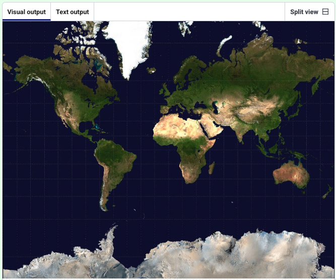

<h2 class="c-project-heading--task">Load and display the map</h2>

--- task ---
Load the map image and display it in a p5 window.
--- /task ---

Use `preload()` to load the image before your sketch starts, then show it in `setup()`.

--- code ---
---
language: python
filename: main.py
line_numbers: true
line_number_start: 1
line_highlights: 5-13
---
#!/bin/python3
from p5 import *                 # Import p5 so we can draw shapes and images
from xy import get_xy_coords     # Import helper to convert latitude/longitude to x/y

def preload():
    global world_map             # Make the map image available to the whole program
    world_map = load_image('mercator.jpeg')  # Load the map image before drawing starts

def setup():
    size(991, 768)               # Set the size of the drawing window
    image(world_map, 0, 0, width, height)  # Draw the map to fill the window

run()                            # Start the p5 sketch

--- /code ---

--- task ---
**Test:** Run your code.  
You should see the world map.
--- /task ---

<pre>
</pre>

