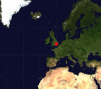

<!-- step_4.md -->
<h2 class="c-project-heading--task">Test coordinate conversion with one marker</h2>

--- task ---
Convert one latitude/longitude pair into x/y coordinates and draw a marker.
--- /task ---

Before reading the dataset, test the conversion with a single known location.

--- code ---
---
language: python
filename: main.py
line_numbers: true
line_number_start: 1
line_highlights: 13-16
---
#!/bin/python3
from p5 import *                 # Import p5 so we can draw graphics
from xy import get_xy_coords     # Import helper to convert latitude/longitude to x/y

def preload():
    global world_map             # Make the map image available to the whole program
    world_map = load_image('mercator.jpeg')  # Load the map image before drawing starts

def setup():
    size(991, 768)               # Set the size of the drawing window
    image(world_map, 0, 0, width, height)  # Draw the map to fill the window

    coords = get_xy_coords(-0.1276, 51.5072)  # Convert longitude and latitude into x/y coordinates
    fill(255, 0, 0)             # Set the colour for the test marker
    no_stroke()                 # Turn off outlines
    ellipse(coords['x'], coords['y'], 8, 8)  # Draw a small circle at the test location

run()                            # Start the p5 sketch

--- /code ---

--- task ---
**Test:** Run your code.  
A red dot should appear around the UK.
--- /task ---

<pre>
</pre>

### Tip

If the dot appears in the wrong place, check you are passing:
- longitude first
- latitude second

