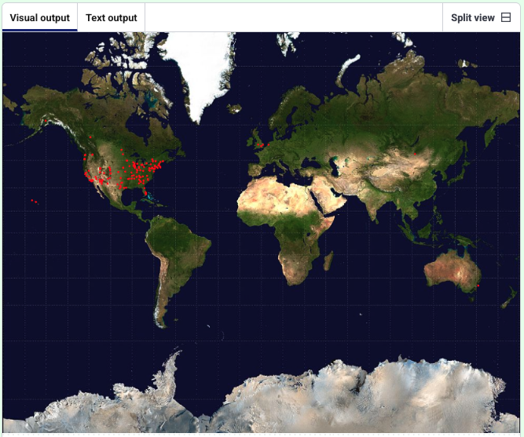

<h2 class="c-project-heading--task">Plot all sightings as simple dots</h2>

--- task ---
Loop through the dataset and draw a dot for each sighting.
--- /task ---

Convert each sighting’s latitude/longitude to x/y coordinates and draw a small marker.

--- code ---
---
language: python
filename: main.py
line_numbers: true
line_number_start: 5
line_highlights: 9-14, 20
---
def preload():
    global world_map
    world_map = load_image('mercator.jpeg')

def draw_data():
    no_stroke()                  # Turn off outlines
    fill(255, 0, 0)              # Red marker colour
    for sighting in ufo_sightings:  # Loop through sightings
        coords = get_xy_coords(float(sighting['longitude']), float(sighting['latitude']))  # Convert lon/lat to x/y
        ellipse(coords['x'], coords['y'], 4, 4)  # Draw a small dot

def setup():
    size(991, 768)
    image(world_map, 0, 0, width, height)
    load_data('ufo-sightings.csv')
    draw_data()                     # Plot the dots

run()

--- /code ---

--- task ---
**Test:** Run your code.  
You should see many small red dots on the map.
--- /task ---

<pre>
</pre>

