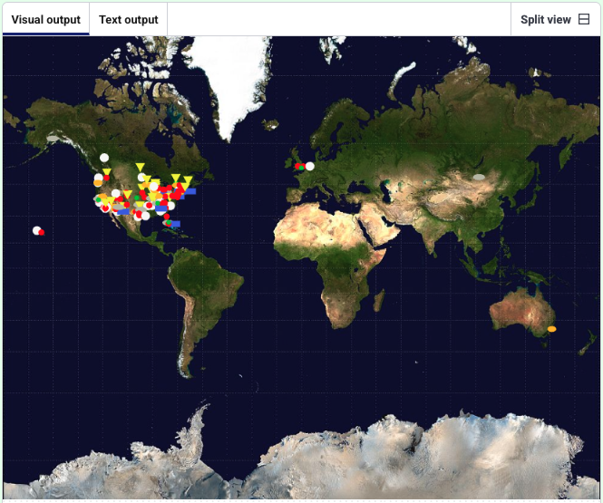

<h2 class="c-project-heading--task">Draw different markers for different UFO shapes</h2>

--- task ---
Draw a different marker depending on the reported UFO shape.
--- /task ---

The dataset includes a `shape` field. You can use it to draw different symbols and colours.

--- code ---
---
language: python
filename: main.py
line_numbers: true
line_number_start: 1
line_highlights: 23-48,57
---

#!/bin/python3
from p5 import *
from xy import get_xy_coords

def preload():
    global world_map
    world_map = load_image('mercator.jpeg')

def load_data(file_name):
    global ufo_sightings
    ufo_sightings = []
    with open(file_name) as f:
        for line in f:
            info = line.strip().split(',')
            ufo_sightings.append({
                'date': info[0],
                'time': info[1],
                'state': info[2],
                'country': info[3],
                'shape': info[4],
                'duration': info[5],
                'latitude': info[6],
                'longitude': info[7]
            })

def draw_ufo(shape, x, y):
    no_stroke()
    if shape == 'fireball':
        fill(252, 186, 3)
        ellipse(x, y, 15, 10)
    elif shape == 'circle':
        fill(32, 201, 49)
        ellipse(x, y, 8, 8)
    elif shape == 'triangle':
        fill(241, 245, 32)
        triangle(x - 8, y - 15, x, y, x + 8, y - 15)
    elif shape == 'light':
        fill(247, 247, 245)
        ellipse(x, y, 15, 15)
    elif shape == 'disk':
        fill(189, 189, 172)
        ellipse(x, y, 20, 10)
    elif shape == 'cylinder' or shape == 'cigar':
        fill(73, 99, 230)
        rect(x, y, 20, 10)
    else:
        fill(255, 0, 0)
        ellipse(x, y, 10, 10)

def draw_data():
    for sighting in ufo_sightings:
        coords = get_xy_coords(float(sighting['longitude']), float(sighting['latitude']))
        draw_ufo(sighting['shape'], coords['x'], coords['y'])

def setup():
    size(991, 768)
    image(world_map, 0, 0, width, height)

    load_data('ufo-sightings.csv')
    draw_data()

run()

--- /code ---

--- task ---
**Test:** Run your code.  
Markers should now vary by colour and shape.
--- /task ---

<pre>
</pre>

