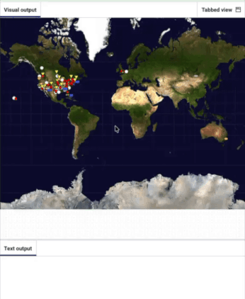

<!-- step_8.md -->
<h2 class="c-project-heading--task">Make markers clickable</h2>

--- task ---
Print a message when the user clicks on a UFO marker.
--- /task ---

You will:
- Draw different coloured markers for different UFO shapes
- Detect the colour of the pixel under the mouse pointer
- Print a message based on the colour that was clicked

--- code ---
---
language: python
filename: main.py
line_numbers: true
line_number_start: 1
line_highlights: 8, 11, 14, 17, 20, 23, 26,38-39, 58-67
---
from p5 import *
from xy import get_xy_coords
from load_data import load_data

def draw_ufo(shape, x, y):
    no_stroke()
    if shape == 'fireball':
        fill(fireball)          # Use the matching colour
        ellipse(x, y, 15, 10)
    elif shape == 'circle':
        fill(circle)          # Use the matching colour
        ellipse(x, y, 8, 8)
    elif shape == 'triangle':
        fill(tri)          # Use the matching colour
        triangle(x-8, y-15, x, y, x+8, y-15)
    elif shape == 'light':
        fill(light)          # Use the matching colour
        ellipse(x, y, 15, 15)
    elif shape == 'disk':
        fill(disk)          # Use the matching colour
        ellipse(x, y, 20, 10)
    elif shape == 'cylinder' or shape == 'cigar':
        fill(cylinder)          # Use the matching colour
        rect(x, y, 20, 10)
    else:
        fill(misc)          # Use the matching colour
        ellipse(x, y, 10, 10)

def preload():
    global map
    map = load_image('mercator.jpeg')

def draw_data():
    for sighting in ufo_sightings:
        coords = get_xy_coords(float(sighting['longitude']), float(sighting['latitude']))
        draw_ufo(sighting['shape'], coords['x'], coords['y'])

def mouse_pressed():        # Run when the mouse is pressed
    pixel_colour = Color(get(mouse_x, mouse_y)).hex  # Colour under the mouse
    if pixel_colour == fireball.hex:
        print('A fireball UFO was spotted here!')
    elif pixel_colour == circle.hex:
        print('A circle shaped UFO was spotted here!')
    elif pixel_colour == tri.hex:
        print('A triangle shaped UFO was spotted here!')
    elif pixel_colour == light.hex:
        print('A UFO made of light was spotted here!')
    elif pixel_colour == disk.hex:
        print('A disk shaped UFO was spotted here!')
    elif pixel_colour == misc.hex:
        print('A random shaped UFO was spotted here!')
    elif pixel_colour == cylinder.hex:
        print('A cylinder shaped UFO was spotted here!')
    else:
        print('There were no UFO sightings in this area!')

def setup():
    global fireball, circle, tri, light, disk, misc, cylinder  # Share colours for clicks
    
    fireball = Color(252, 186, 3)   # Colour for fireballs
    circle = Color(32, 201, 49)     # Colour for circles
    tri = Color(241, 245, 32)       # Colour for triangles
    light = Color(247, 247, 245)    # Colour for lights
    disk = Color(189, 189, 172)     # Colour for disks
    misc = Color(255, 0, 0)         # Colour for other shapes
    cylinder = Color(73, 99, 230)   # Colour for cylinders
    
    size(991, 768)
    load_data('ufo-sightings.csv')
    image(map, 0, 0, width, height)
    draw_data()

run()

--- /code ---

--- task ---
**Test:** Run your code, then click on different markers.  
You should see different messages in the output depending on what you clicked.
--- /task ---

<pre>
</pre>

### Debugging

- If clicking always prints “There were no UFO sightings in this area!”, check that the map image is drawn **before** `draw_data()`
- If you see an error about `color` or `null`, make sure the sketch is running and the window has loaded before clicking
- If every click says “no sightings”, check the markers are drawn after the map image
- If colours never match, check you are using the same `Color(...)` objects for drawing and comparison

